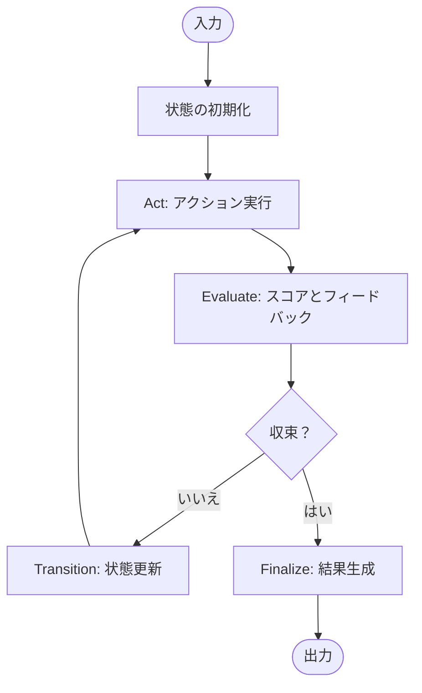

# IteratoP

> LLMを使った収束型イテレーションループを構築するための強力なTypeScriptライブラリ。Scrumイテレーションと OODAループにインスパイアされています。

## 名前の由来

IteratoP = **Iterat**i**o**n **P**rocessor（イテレーション・プロセッサー）

名前はライブラリのコア目的を反映しています：収束までイテレーションを処理すること。"P"サフィックスはAid-Onプラットフォームのプロセッサーライブラリの命名規則に従っています（例：FractoP = フラクタル処理）。

[](https://www.typescriptlang.org/)
[](https://opensource.org/licenses/MIT)
[]()

日本語 | [English](README.md)

## 特徴

- **収束型ループ** - 品質目標に到達するまで自動的に反復
- **柔軟な設定** - Builderパターン、プリセット、動的更新など多様な設定方法
- **組み込みメトリクス** - コスト、パフォーマンス、収束スコアを追跡
- **Builderパターン** - 直感的なセットアップのための流暢なAPI
- **プリセット** - 一般的なユースケース用の事前設定
- **イベントシステム** - イテレーションライフサイクルイベントにフック
- **型安全** - ジェネリクスによる完全なTypeScriptサポート
- **エラー回復** - 組み込みエラー処理とフォールバック機構
- **パフォーマンス最適化** - 早期停止による効率的な反復

## インストール

```bash
npm install @aid-on/iteratop
# または
yarn add @aid-on/iteratop
# または
pnpm add @aid-on/iteratop
```

## クイックスタート

### 基本的な使い方

```typescript
import { createIterator, createActionResult, createEvaluation } from '@aid-on/iteratop';

const processor = createIterator({
  initialize: async (input) => ({ 
    query: input, 
    results: [] 
  }),
  
  act: async (state) => {
    const data = await searchAPI(state.query);
    return createActionResult(data, { cost: 0.01 });
  },
  
  evaluate: async (state, actionResult) => {
    const score = calculateRelevance(actionResult.data);
    return createEvaluation(score, {
      shouldContinue: score < 70,
      feedback: `関連性: ${score}%`,
    });
  },
  
  transition: async (state, actionResult, evaluation) => ({
    ...state,
    results: [...state.results, actionResult.data],
    query: refineQuery(state.query, evaluation.feedback),
  }),
  
  finalize: async (state) => ({
    answer: synthesizeAnswer(state.results),
  }),
});

const result = await processor.run("量子コンピューティングとは？");
console.log(`回答: ${result.result.answer}`);
console.log(`${result.iterations}回のイテレーションで収束`);
```

### Builderパターンの使用

```typescript
import { iterationBuilder } from '@aid-on/iteratop';

const result = await iterationBuilder()
  .initialize(async (input) => ({ value: input }))
  .act(async (state) => createActionResult(state.value * 2))
  .evaluate(async (_, result) => createEvaluation(result.data))
  .transition(async (_, result) => ({ value: result.data }))
  .finalize(async (state) => state.value)
  .preset('balanced')
  .maxIterations(5)
  .targetScore(80)
  .run(10);
```

## 概念

### イテレーションフロー

IteratoPは、ScrumとOODAループにインスパイアされた構造化されたイテレーションフローに従います：



1. **Initialize** (スプリント計画) - 入力から初期状態を設定
2. **Act** (スプリント実行) - 現在の状態に基づいてアクションを実行
3. **Evaluate** (スプリントレビュー) - 進捗を評価してフィードバックを生成
4. **Transition** (振り返り) - 次のイテレーションのために状態を更新
5. **Finalize** (リリース) - 収束した状態から最終結果を生成

## 設定

### 利用可能なプリセット

```typescript
import { DEFAULT_PRESETS } from '@aid-on/iteratop';

// 利用可能なすべてのプリセットとその値を表示
console.log(DEFAULT_PRESETS);

// 利用可能なプリセット:
// - 'fast': 迅速な収束、最小限のイテレーション (最大3回、スコア60)
// - 'thorough': 高品質、より多くのイテレーション (最大10回、スコア90)
// - 'balanced': デフォルトのバランスアプローチ (最大5回、スコア70)
// - 'cost-optimized': APIコールとコストを最小化 (最大3回、最小スキップ)

// プリセットを使用
const processor = iterationBuilder()
  .preset('thorough')
  // ... その他の設定
  .build();
```

### カスタム設定

```typescript
const processor = createIterator(options, {
  // イテレーション制御
  maxIterations: 5,          // 最大イテレーション数 (デフォルト: 5)
  targetScore: 70,           // 目標収束スコア (デフォルト: 70)
  earlyStopScore: 95,        // 早期終了スコア (デフォルト: 95)
  minIterations: 1,          // 停止前の最小イテレーション数 (デフォルト: 1)
  
  // パフォーマンス
  timeout: 10000,            // 全体のタイムアウト（ミリ秒）
  skipMinIterations: false,  // minIterations前の早期停止を許可
  
  // 状態管理
  alwaysRunTransition: true, // 最終イテレーションでもtransitionを実行
  
  // デバッグ
  verbose: true,             // ログ有効化 (デフォルト: false)
  logger: {                  // カスタムロガー
    error: console.error,
    log: console.log,
  },
});
```

### 動的設定

```typescript
// 作成後に設定を更新
processor
  .updateConfig({ maxIterations: 10 })
  .updateConfig({ verbose: true });

// 異なる設定でバリアントを作成
const processor2 = processor.withConfig({ targetScore: 90 });

// デフォルトにリセット
processor.resetConfig();
```

## 高度な使い方

### イベント処理

```typescript
processor.on((event) => {
  switch (event.type) {
    case 'iteration_start':
      console.log(`イテレーション ${event.iteration + 1} 開始`);
      break;
    case 'evaluation_complete':
      console.log(`スコア: ${event.evaluation.score}`);
      break;
    case 'converged':
      console.log(`イテレーション ${event.iteration + 1} で収束`);
      break;
    case 'complete':
      console.log(`最終結果: ${JSON.stringify(event.result)}`);
      break;
  }
});
```

### エラー処理

```typescript
const processor = createIterator({
  // ... その他のオプション ...
  onError: async (error, state, context) => {
    console.error(`イテレーション ${context.iteration} でエラー:`, error);
    // フォールバック結果を返す
    return { 
      fallback: true, 
      partialData: state?.results || [],
      error: error.message 
    };
  },
});
```

### カスタム終了条件

```typescript
const processor = createIterator({
  // ... その他のオプション ...
  shouldTerminate: (state, evaluation, context) => {
    // カスタム終了ロジック
    return (
      state.attempts > 3 || 
      evaluation.score > 90 ||
      state.costs > 1.00
    );
  },
});
```

## ユーティリティ

### 結果分析

```typescript
import {
  calculateTotalCost,
  calculateAverageScore,
  getScoreProgression,
  isImproving,
} from '@aid-on/iteratop';

// イテレーション履歴を分析
const totalCost = calculateTotalCost(result.history);
const avgScore = calculateAverageScore(result.history);
const scores = getScoreProgression(result.history);
const improving = isImproving(result.history, windowSize = 2);
```

### 結果のマージ

```typescript
import {
  mergeActionResults,
  mergeArrayActionResults,
  mergeObjectActionResults,
} from '@aid-on/iteratop';

// 重複排除を含む配列結果のマージ
const merged = mergeArrayActionResults(
  [result1, result2],
  item => item.id  // 重複排除キー
);

// オブジェクトのディープマージ
const merged = mergeObjectActionResults(results, 'deep');

// カスタムマージ戦略
const merged = mergeActionResults(results, items => 
  items.reduce((acc, item) => ({ ...acc, ...item }), {})
);
```

### 非同期ユーティリティ

```typescript
import { withRetry, withTimeout, sleep } from '@aid-on/iteratop';

// 指数バックオフでリトライ
const data = await withRetry(
  () => fetchData(url),
  { 
    maxRetries: 3, 
    initialDelay: 1000,
    backoffFactor: 2 
  }
);

// タイムアウトを追加
const result = await withTimeout(
  longOperation(),
  5000,
  '操作がタイムアウトしました'
);
```

## 実世界の例

### 品質改善を伴うLLMチェーン

```typescript
const refiner = iterationBuilder()
  .initialize(async (prompt) => ({
    prompt,
    response: '',
    history: [],
  }))
  .act(async (state) => {
    const response = await llm.generate(state.prompt);
    return createActionResult(response, { 
      cost: 0.002 * response.tokens / 1000 
    });
  })
  .evaluate(async (state, result) => {
    const quality = await evaluateQuality(result.data);
    const issues = await findIssues(result.data);
    
    return createEvaluation(quality.score, {
      shouldContinue: quality.score < 80,
      feedback: quality.feedback,
      missingInfo: issues,
    });
  })
  .transition(async (state, result, evaluation) => ({
    ...state,
    response: result.data,
    history: [...state.history, result.data],
    prompt: improvePrompt(state.prompt, evaluation.feedback),
  }))
  .finalize(async (state) => ({
    finalAnswer: state.response,
    iterations: state.history.length,
    quality: await evaluateQuality(state.response),
  }))
  .preset('thorough')
  .build();
```

### マルチソースリサーチエージェント

```typescript
const researcher = iterationBuilder()
  .initialize(async (topic) => ({
    topic,
    sources: [],
    knowledge: {},
    gaps: [],
  }))
  .act(async (state) => {
    // 並列検索
    const searches = await Promise.all([
      searchWeb(state.topic),
      searchAcademic(state.topic),
      searchNews(state.topic),
    ]);
    
    return createActionResult(searches.flat(), { 
      cost: 0.05,
      sources: searches.map(s => s.url),
    });
  })
  .evaluate(async (state, results) => {
    const coverage = assessCoverage(state.knowledge, state.topic);
    const reliability = assessReliability(results.data);
    const score = (coverage * 0.7 + reliability * 0.3);
    
    return createEvaluation(score, {
      shouldContinue: score < 85,
      missingInfo: identifyGaps(state.knowledge, state.topic),
    });
  })
  .transition(async (state, results, evaluation) => ({
    ...state,
    sources: [...state.sources, ...results.data],
    knowledge: mergeKnowledge(state.knowledge, results.data),
    gaps: evaluation.missingInfo || [],
    topic: refineTopic(state.topic, evaluation.missingInfo),
  }))
  .finalize(async (state) => ({
    report: generateReport(state.knowledge),
    sources: rankSources(state.sources),
    confidence: calculateConfidence(state.knowledge),
    gaps: state.gaps,
  }))
  .preset('thorough')
  .verbose(true)
  .build();
```

### ファクトチェッキングシステム

```typescript
const factChecker = createIterator({
  initialize: async (claim) => ({
    claim,
    evidence: [],
    queries: [claim],
    verdict: 'UNKNOWN',
  }),

  act: async (state, context) => {
    const query = state.queries[context.iteration] || state.claim;
    const evidence = await gatherEvidence(query);
    return createActionResult(evidence, {
      cost: 0.01 * evidence.length,
      sources: evidence.map(e => e.source),
    });
  },

  evaluate: async (state, actionResult) => {
    const allEvidence = [...state.evidence, ...actionResult.data];
    const analysis = await analyzeClaim(state.claim, allEvidence);
    
    return createEvaluation(analysis.confidence, {
      shouldContinue: analysis.confidence < 70 && state.queries.length < 5,
      feedback: analysis.reasoning,
      missingInfo: analysis.missingEvidence,
    });
  },

  transition: async (state, actionResult, evaluation) => ({
    ...state,
    evidence: [...state.evidence, ...actionResult.data],
    queries: evaluation.missingInfo ? 
      [...state.queries, ...generateQueries(evaluation.missingInfo)] :
      state.queries,
    verdict: determineVerdict(evaluation.score),
  }),

  finalize: async (state, history) => ({
    claim: state.claim,
    verdict: state.verdict,
    confidence: history[history.length - 1]?.evaluation.score || 0,
    evidence: rankEvidence(state.evidence),
    reasoning: generateReasoning(state),
  }),
}, {
  maxIterations: 5,
  targetScore: 70,
  earlyStopScore: 90,
});
```

## パフォーマンスのヒント

1. **プリセットを使用** - プリセットから始めて必要に応じて調整
2. **適切なタイムアウトを設定** - 無限ループを防ぐ
3. **コストを監視** - メタデータでAPIコストを追跡
4. **早期停止を使用** - 不必要なイテレーションを避けるため`earlyStopScore`を設定
5. **バッチ操作** - 可能な場合は`act`で並列操作を実行
6. **結果をキャッシュ** - アクション関数でキャッシングを実装
7. **イベントを賢く使用** - イベントリスナーで重い処理を避ける

## アーキテクチャ

### コアコンポーネント

```
src/
├── core.ts           # メインのIterationProcessorクラス
├── builder.ts        # Builder パターンの実装
├── types.ts          # TypeScript型定義
├── utils.ts          # ユーティリティ関数
└── index.ts          # パブリックAPIエクスポート
```

### 設計原則

1. **関心の分離** - 各フェーズ（Initialize、Act、Evaluate、Transition、Finalize）は独立
2. **拡張性** - イベントシステムとカスタムハンドラーによる容易な拡張
3. **型安全性** - ジェネリクスによる完全な型推論
4. **テスタビリティ** - 99%のコードカバレッジを持つ包括的なテストスイート

## ライセンス

MIT © Aid-On

---

Aid-Onチームによって作られました