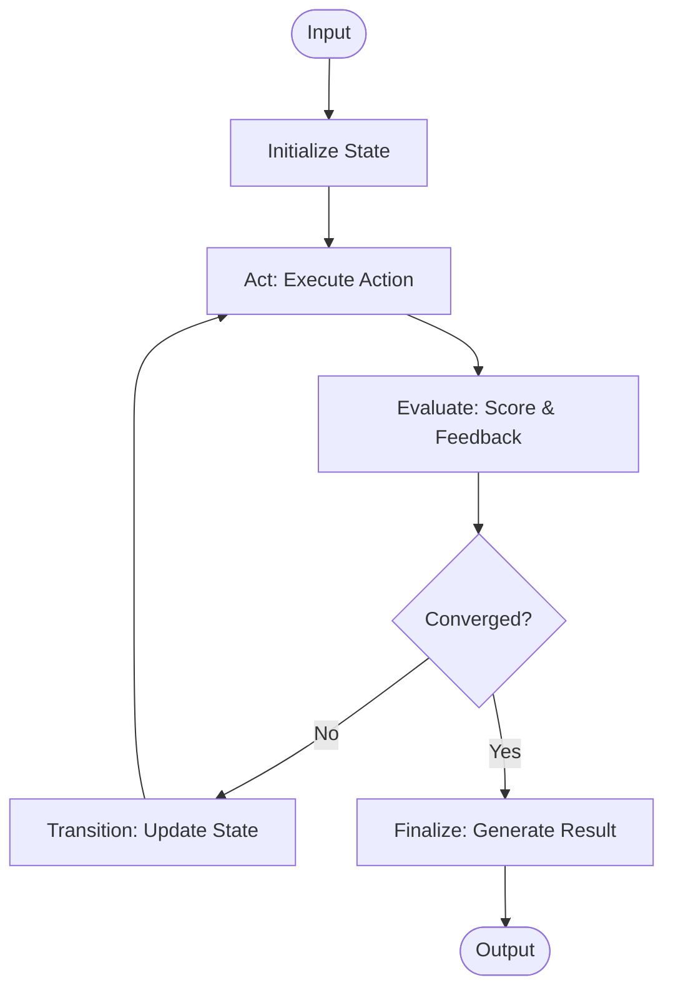

# IteratoP

> A powerful TypeScript library for building convergent iteration loops with LLMs, inspired by Scrum iterations and OODA loops.

## Name Origin

IteratoP = **Iterat**i**o**n **P**rocessor

The name reflects the library's core purpose: processing iterations until convergence. The "P" suffix follows the Aid-On platform's naming convention for processor libraries (like FractoP for fractal processing).

[](https://www.typescriptlang.org/)
[](https://opensource.org/licenses/MIT)
[]()

[日本語](README.ja.md) | English

## Features

- **Convergent Loops** - Automatically iterate until quality targets are reached
- **Flexible Configuration** - Multiple ways to configure: Builder pattern, presets, dynamic updates
- **Built-in Metrics** - Track costs, performance, and convergence scores
- **Builder Pattern** - Fluent API for intuitive setup
- **Presets** - Pre-configured settings for common use cases
- **Event System** - Hook into iteration lifecycle events
- **Type Safe** - Full TypeScript support with generics
- **Error Recovery** - Built-in error handling and fallback mechanisms
- **Performance Optimized** - Efficient iteration with early stopping

## Installation

```bash
npm install @aid-on/iteratop
# or
yarn add @aid-on/iteratop
# or
pnpm add @aid-on/iteratop
```

## What's New in v0.2.0

- **Nagare Streaming Support**: Integration with [@aid-on/nagare](https://github.com/Aid-On/nagare) for real-time iteration streaming
- **StreamingIteratoP**: Stream iteration states as they happen
- **Full Backward Compatibility**: All existing code continues to work

## Quick Start

### Basic Usage

```typescript
import { createIterator, createActionResult, createEvaluation } from '@aid-on/iteratop';

const processor = createIterator({
  initialize: async (input) => ({ 
    query: input, 
    results: [] 
  }),
  
  act: async (state) => {
    const data = await searchAPI(state.query);
    return createActionResult(data, { cost: 0.01 });
  },
  
  evaluate: async (state, actionResult) => {
    const score = calculateRelevance(actionResult.data);
    return createEvaluation(score, {
      shouldContinue: score < 70,
      feedback: `Relevance: ${score}%`,
    });
  },
  
  transition: async (state, actionResult, evaluation) => ({
    ...state,
    results: [...state.results, actionResult.data],
    query: refineQuery(state.query, evaluation.feedback),
  }),
  
  finalize: async (state) => ({
    answer: synthesizeAnswer(state.results),
  }),
});

const result = await processor.run("What is quantum computing?");
console.log(`Answer: ${result.result.answer}`);
console.log(`Converged in ${result.iterations} iterations`);
```

### Using Builder Pattern

```typescript
import { iterationBuilder } from '@aid-on/iteratop';

const result = await iterationBuilder()
  .initialize(async (input) => ({ value: input }))
  .act(async (state) => createActionResult(state.value * 2))
  .evaluate(async (_, result) => createEvaluation(result.data))
  .transition(async (_, result) => ({ value: result.data }))
  .finalize(async (state) => state.value)
  .preset('balanced')
  .maxIterations(5)
  .targetScore(80)
  .run(10);
```

## Concepts

### Iteration Flow

IteratoP follows a structured iteration flow inspired by Scrum and OODA loops:



1. **Initialize** (Sprint Planning) - Set up initial state from input
2. **Act** (Sprint Execution) - Execute actions based on current state
3. **Evaluate** (Sprint Review) - Assess progress and generate feedback
4. **Transition** (Retrospective) - Update state for next iteration
5. **Finalize** (Release) - Generate final result from converged state

## Configuration

### Streaming Iterations (v0.2.0+)

Stream iteration states in real-time using nagare Stream<T>:

```typescript
import { createStreamingIterator } from '@aid-on/iteratop';
import { createActionResult, createEvaluation } from '@aid-on/iteratop';

const processor = createStreamingIterator({
  initialize: async (input) => ({ query: input, confidence: 0 }),
  
  act: async (state, context) => 
    createActionResult({ 
      data: await searchDatabase(state.query) 
    }),
  
  evaluate: async (state, actionResult, context) => 
    createEvaluation(calculateConfidence(actionResult.data), {
      shouldContinue: state.confidence < 80,
      feedback: 'Refining search...'
    }),
  
  transition: async (state, actionResult, evaluation) => ({
    ...state,
    query: refineQuery(state.query, evaluation.feedback),
    confidence: evaluation.score
  })
});

// Stream all iteration states
const stream = await processor.executeStream("LLM optimization techniques");
for await (const state of stream) {
  console.log(`Iteration ${state.iteration}: ${state.converged ? 'Converged!' : 'Processing...'}`);
  if (state.evaluation) {
    console.log(`  Score: ${state.evaluation.score}`);
  }
}

// Or stream just evaluations
const evaluations = await processor.evaluationStream("LLM optimization");
for await (const evaluation of evaluations) {
  console.log(`Score: ${evaluation.score} - ${evaluation.feedback}`);
}
```

### Available Presets

```typescript
import { DEFAULT_PRESETS } from '@aid-on/iteratop';

// View all available presets and their values
console.log(DEFAULT_PRESETS);

// Available presets:
// - 'fast': Quick convergence, minimal iterations (3 max, score 60)
// - 'thorough': Higher quality, more iterations (10 max, score 90)
// - 'balanced': Default balanced approach (5 max, score 70)
// - 'cost-optimized': Minimize API calls and costs (3 max, skip min)

// Use a preset
const processor = iterationBuilder()
  .preset('thorough')
  // ... other configurations
  .build();
```

### Custom Configuration

```typescript
const processor = createIterator(options, {
  // Iteration Control
  maxIterations: 5,          // Maximum iterations (default: 5)
  targetScore: 70,           // Target convergence score (default: 70)
  earlyStopScore: 95,        // Early termination score (default: 95)
  minIterations: 1,          // Minimum iterations before stopping (default: 1)
  
  // Performance
  timeout: 10000,            // Overall timeout in ms (optional)
  skipMinIterations: false,  // Allow early stop before minIterations
  
  // State Management
  alwaysRunTransition: true, // Run transition on final iteration
  
  // Debugging
  verbose: true,             // Enable logging (default: false)
  logger: {                  // Custom logger
    error: console.error,
    log: console.log,
  },
});
```

### Dynamic Configuration

```typescript
// Update configuration after creation
processor
  .updateConfig({ maxIterations: 10 })
  .updateConfig({ verbose: true });

// Create variant with different config
const processor2 = processor.withConfig({ targetScore: 90 });

// Reset to defaults
processor.resetConfig();
```

## Advanced Usage

### Event Handling

```typescript
processor.on((event) => {
  switch (event.type) {
    case 'iteration_start':
      console.log(`Starting iteration ${event.iteration + 1}`);
      break;
    case 'evaluation_complete':
      console.log(`Score: ${event.evaluation.score}`);
      break;
    case 'converged':
      console.log(`Converged at iteration ${event.iteration + 1}`);
      break;
    case 'complete':
      console.log(`Final: ${JSON.stringify(event.result)}`);
      break;
  }
});
```

### Error Handling

```typescript
const processor = createIterator({
  // ... other options ...
  onError: async (error, state, context) => {
    console.error(`Error at iteration ${context.iteration}:`, error);
    // Return fallback result
    return { 
      fallback: true, 
      partialData: state?.results || [],
      error: error.message 
    };
  },
});
```

### Custom Termination

```typescript
const processor = createIterator({
  // ... other options ...
  shouldTerminate: (state, evaluation, context) => {
    // Custom termination logic
    return (
      state.attempts > 3 || 
      evaluation.score > 90 ||
      state.costs > 1.00
    );
  },
});
```

## Utilities

### Result Analysis

```typescript
import {
  calculateTotalCost,
  calculateAverageScore,
  getScoreProgression,
  isImproving,
} from '@aid-on/iteratop';

// Analyze iteration history
const totalCost = calculateTotalCost(result.history);
const avgScore = calculateAverageScore(result.history);
const scores = getScoreProgression(result.history);
const improving = isImproving(result.history, windowSize = 2);
```

### Merging Results

```typescript
import {
  mergeActionResults,
  mergeArrayActionResults,
  mergeObjectActionResults,
} from '@aid-on/iteratop';

// Merge array results with deduplication
const merged = mergeArrayActionResults(
  [result1, result2],
  item => item.id  // Deduplication key
);

// Deep merge objects
const merged = mergeObjectActionResults(results, 'deep');

// Custom merge strategy
const merged = mergeActionResults(results, items => 
  items.reduce((acc, item) => ({ ...acc, ...item }), {})
);
```

### Async Utilities

```typescript
import { withRetry, withTimeout, sleep } from '@aid-on/iteratop';

// Retry with exponential backoff
const data = await withRetry(
  () => fetchData(url),
  { 
    maxRetries: 3, 
    initialDelay: 1000,
    backoffFactor: 2 
  }
);

// Add timeout
const result = await withTimeout(
  longOperation(),
  5000,
  'Operation timed out'
);
```

## Real-World Examples

### LLM Chain with Quality Refinement

```typescript
const refiner = iterationBuilder()
  .initialize(async (prompt) => ({
    prompt,
    response: '',
    history: [],
  }))
  .act(async (state) => {
    const response = await llm.generate(state.prompt);
    return createActionResult(response, { 
      cost: 0.002 * response.tokens / 1000 
    });
  })
  .evaluate(async (state, result) => {
    const quality = await evaluateQuality(result.data);
    const issues = await findIssues(result.data);
    
    return createEvaluation(quality.score, {
      shouldContinue: quality.score < 80,
      feedback: quality.feedback,
      missingInfo: issues,
    });
  })
  .transition(async (state, result, evaluation) => ({
    ...state,
    response: result.data,
    history: [...state.history, result.data],
    prompt: improvePrompt(state.prompt, evaluation.feedback),
  }))
  .finalize(async (state) => ({
    finalAnswer: state.response,
    iterations: state.history.length,
    quality: await evaluateQuality(state.response),
  }))
  .preset('thorough')
  .build();
```

### Multi-Source Research Agent

```typescript
const researcher = iterationBuilder()
  .initialize(async (topic) => ({
    topic,
    sources: [],
    knowledge: {},
    gaps: [],
  }))
  .act(async (state) => {
    // Parallel searches
    const searches = await Promise.all([
      searchWeb(state.topic),
      searchAcademic(state.topic),
      searchNews(state.topic),
    ]);
    
    return createActionResult(searches.flat(), { 
      cost: 0.05,
      sources: searches.map(s => s.url),
    });
  })
  .evaluate(async (state, results) => {
    const coverage = assessCoverage(state.knowledge, state.topic);
    const reliability = assessReliability(results.data);
    const score = (coverage * 0.7 + reliability * 0.3);
    
    return createEvaluation(score, {
      shouldContinue: score < 85,
      missingInfo: identifyGaps(state.knowledge, state.topic),
    });
  })
  .transition(async (state, results, evaluation) => ({
    ...state,
    sources: [...state.sources, ...results.data],
    knowledge: mergeKnowledge(state.knowledge, results.data),
    gaps: evaluation.missingInfo || [],
    topic: refineTopic(state.topic, evaluation.missingInfo),
  }))
  .finalize(async (state) => ({
    report: generateReport(state.knowledge),
    sources: rankSources(state.sources),
    confidence: calculateConfidence(state.knowledge),
    gaps: state.gaps,
  }))
  .preset('thorough')
  .verbose(true)
  .build();
```

### Fact-Checking System

```typescript
const factChecker = createIterator({
  initialize: async (claim) => ({
    claim,
    evidence: [],
    queries: [claim],
    verdict: 'UNKNOWN',
  }),

  act: async (state, context) => {
    const query = state.queries[context.iteration] || state.claim;
    const evidence = await gatherEvidence(query);
    return createActionResult(evidence, {
      cost: 0.01 * evidence.length,
      sources: evidence.map(e => e.source),
    });
  },

  evaluate: async (state, actionResult) => {
    const allEvidence = [...state.evidence, ...actionResult.data];
    const analysis = await analyzeClaim(state.claim, allEvidence);
    
    return createEvaluation(analysis.confidence, {
      shouldContinue: analysis.confidence < 70 && state.queries.length < 5,
      feedback: analysis.reasoning,
      missingInfo: analysis.missingEvidence,
    });
  },

  transition: async (state, actionResult, evaluation) => ({
    ...state,
    evidence: [...state.evidence, ...actionResult.data],
    queries: evaluation.missingInfo ? 
      [...state.queries, ...generateQueries(evaluation.missingInfo)] :
      state.queries,
    verdict: determineVerdict(evaluation.score),
  }),

  finalize: async (state, history) => ({
    claim: state.claim,
    verdict: state.verdict,
    confidence: history[history.length - 1]?.evaluation.score || 0,
    evidence: rankEvidence(state.evidence),
    reasoning: generateReasoning(state),
  }),
}, {
  maxIterations: 5,
  targetScore: 70,
  earlyStopScore: 90,
});
```

## Performance Tips

1. **Use Presets** - Start with presets and adjust as needed
2. **Set Appropriate Timeouts** - Prevent infinite loops
3. **Monitor Costs** - Track API costs with metadata
4. **Use Early Stopping** - Set `earlyStopScore` to avoid unnecessary iterations
5. **Batch Operations** - Perform parallel operations in `act` when possible
6. **Cache Results** - Implement caching in your action functions
7. **Use Events Wisely** - Don't perform heavy operations in event listeners

## License

MIT © Aid-On

---

Built by the Aid-On team